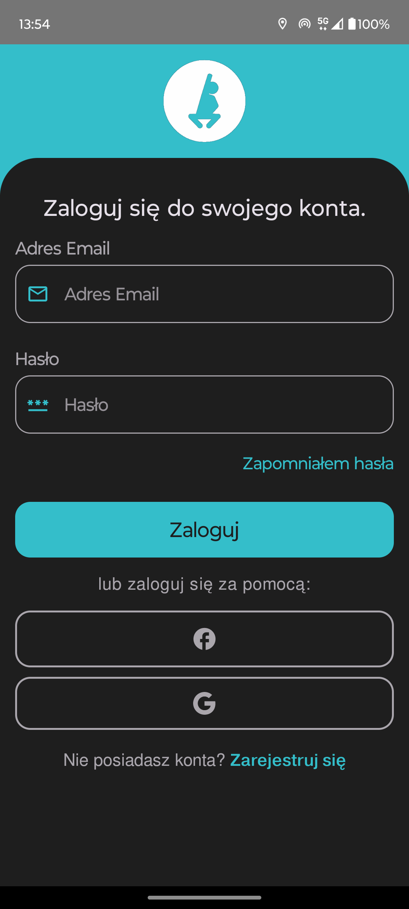
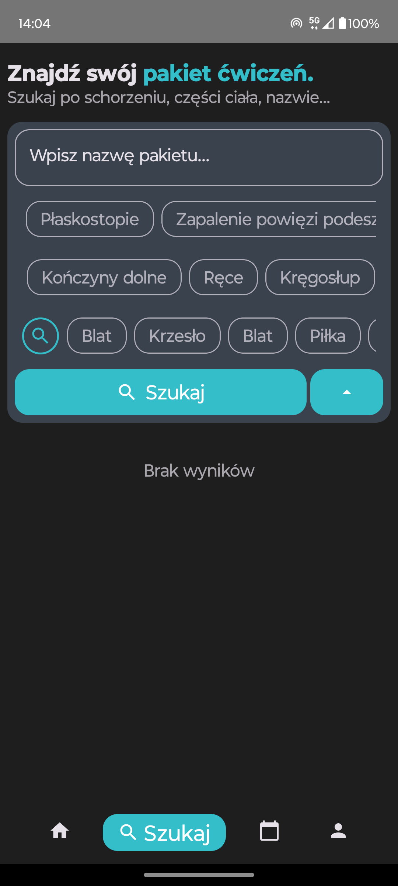
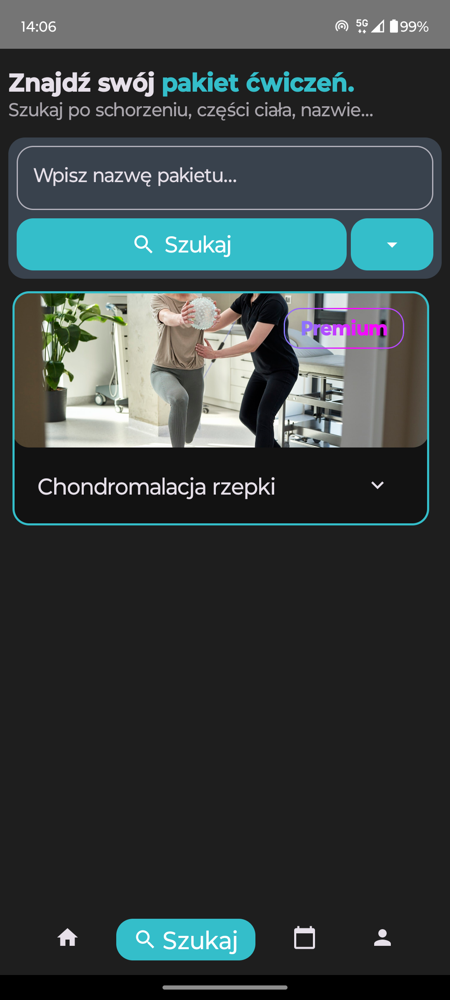
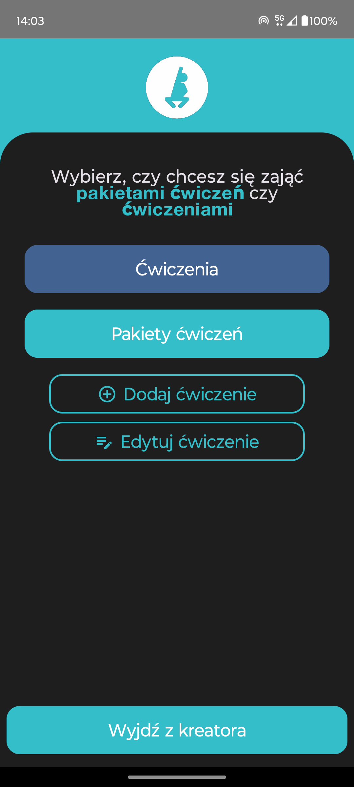
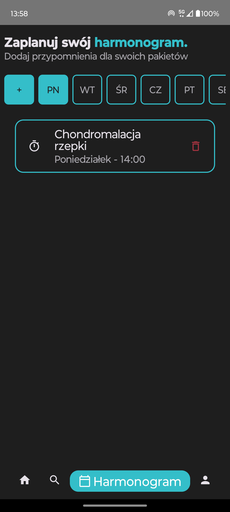
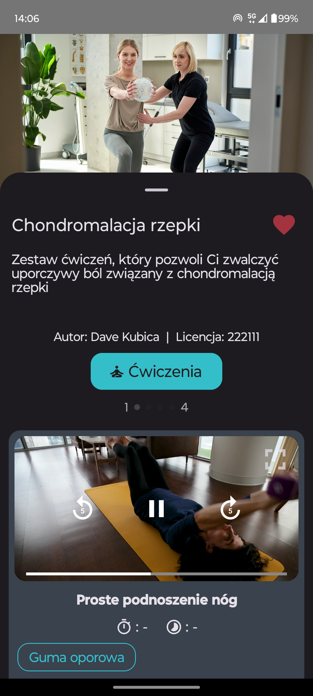
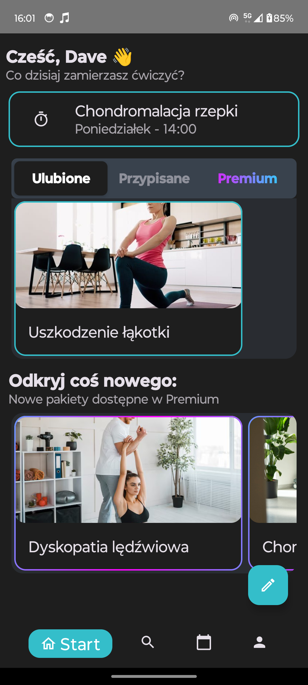
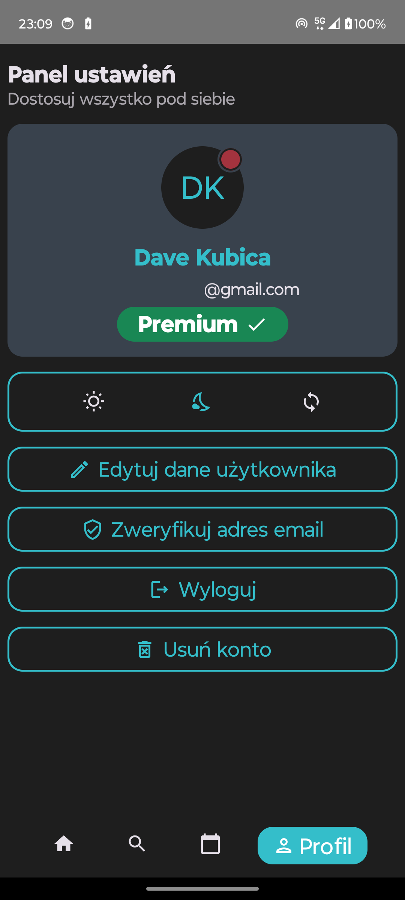

# Physio 
### Mobile app for Android   
The "Physio" mobile application is designed to assist with physical rehabilitation in a home environment, tailored for Android devices. Its primary goal is to empower both patients and physiotherapists by providing intuitive tools for planning, executing, and tracking therapeutic exercises.

**Functionalities**

* **User Profiles and Registration**   
The app supports two types of users: regular users and physiotherapists. Physiotherapists have additional privileges, such as creating and managing exercise plans. Users can register using an email and password or via external providers like Google or Facebook.  
  
* **Exercise Management**   
Users can browse and access a library of pre-defined exercises and exercise packages. The exercises include detailed descriptions, multimedia content (videos and images), and instructions for proper execution. Filtering options allow users to find exercises based on body parts, equipment, or specific conditions.  
   
   
* **Content Creation for Therapists**   
Physiotherapists can create and manage custom exercise packages and individual exercises. They can specify parameters such as repetitions, duration, equipment needed, and attach multimedia content. These can be shared with their patients or kept private. 
   
* **Scheduling and Notifications**   
The app includes a scheduler where users can set reminders for their exercise routines. Push notifications ensure users are reminded on time, promoting consistency in rehabilitation efforts. 
   
* **Interactive Viewing Modes**   
Exercises can be viewed in fullscreen mode for better focus during performance. This mode is optimized for devices of various sizes and supports horizontal orientation for multimedia playback. 
  
   
* **User-Friendly Navigation**   
With a clean and intuitive interface, the app follows Material Design guidelines, ensuring all functionalities are accessible within three steps from the main screen.  
   

**Technologies Used**

* **Kotlin and Jetpack Compose**   
The app leverages Kotlin as the primary programming language, combined with Jetpack Compose for creating a modern and responsive user interface.
* **Google Firebase Integration**   
  * Firestore: A NoSQL database for storing user data, exercises, and packages.
  * Firebase Storage: Handles multimedia content like images and videos.
  * Firebase Authentication: Manages user accounts and supports multi-method login options.
* **Other Libraries**   
Additional libraries like Dagger Hilt (for dependency injection), Glide (for image handling), and RichTextEditor enhance functionality and performance.

Physio bridges the gap between patients and physiotherapists, offering an efficient and engaging platform for physical rehabilitation. Its robust set of features, combined with modern technologies, ensures reliability, scalability, and ease of use, making it a valuable tool for rehabilitation in the digital age.
**The app is still in development.**
